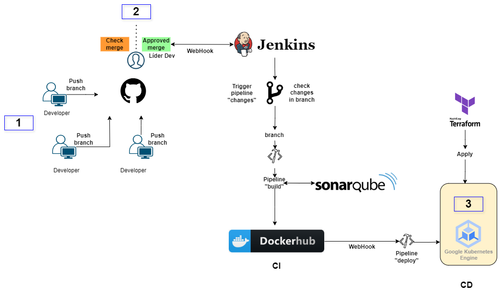

# [URL de Despliegue](https://estevanca.tech/)


# Proyecto DevOps



## Introducción

Este proyecto es una demostración de prácticas y configuraciones de DevOps utilizando Docker, Jenkins y Kubernetes.

## Estructura del Proyecto

El proyecto tiene la siguiente estructura:

```
Devco/
├── app/
│   ├── dockerfile
│   ├── Jenkinsfile
│   ├── requirements.txt
│   └── __init__.py
|   └── test.py
└── k8s/
    ├── deployment.yaml
    └── Jenkinsfile
└── terraform
    ├── main.tf
    ├── outputs.tf
    ├── terraform.tfvars
    ├── variables.tf
    ├── versions.tf
    └── main.tf 
└── Jenkinsfile  
```

## Configuración y Despliegue

### Dockerfile

El `dockerfile` define la imagen de Docker para la aplicación. Aquí se instalan las dependencias necesarias y se configura el entorno de ejecución.

```dockerfile
FROM python:3.8-slim

WORKDIR /app

COPY requirements.txt requirements.txt
RUN pip install -r requirements.txt

COPY . .

CMD ["python", "app.py"]
```

### Jenkinsfile

El `Jenkinsfile` se utiliza para definir el pipeline de Jenkins para la integración y entrega continua (CI/CD).

#### Jenkinsfile en `app/`

```groovy
pipeline {
    agent any
    environment {
        TARGET_DIR = 'devops_prueba/app'
        REPOSITORY = 'estevancastro98/devco'
        TAG = 'test-devco'
        IMAGE_NAME = "${env.REPOSITORY}:${env.TAG}-${BUILD_NUMBER}"
    }

    stages {
        stage('Configurar Entorno Python') {
            steps {
                script {
                    sh 'python3 -m venv venv'
                    sh './venv/bin/pip install --upgrade pip'
                    sh './venv/bin/pip install pytest flask'
                }
            }
        }

        stage('Pruebas Unitarias') {
            steps {
                script {
                    sh './venv/bin/pytest devops_prueba/app/test.py --junitxml=report.xml'
                }
            }
        }

        stage('Análisis de Código con SonarQube') {
            environment {
                scannerHome = tool 'SonarQubeScanner'
            }
            steps {
                dir("${WORKSPACE}") {
                    script {
                        withSonarQubeEnv('SonarQubeScanner') {
                            sh """
                            ${scannerHome}/bin/sonar-scanner \
                            -Dsonar.projectKey=your_project_key \
                            -Dsonar.projectName=${env.TAG} \
                            -Dsonar.projectVersion=1.0-SNAPSHOT \
                            -Dsonar.sources=${env.TARGET_DIR} \
                            -Dsonar.sourceEncoding=UTF-8
                            """
                        }
                    }
                }
            }
        }

        stage('Verificación de Quality Gate') {
            steps {
                timeout(time: 1, unit: 'HOURS') {
                    waitForQualityGate abortPipeline: true
                }
            }
        }

        stage('Construir Imagen Docker - Etiqueta del Número de Compilación') {
            steps {
                script {
                    sh "docker build -t ${env.IMAGE_NAME} ${WORKSPACE}/${env.TARGET_DIR}/"
                }
            }
        }

        stage('Escaneo de Vulnerabilidades con Trivy') {
            steps {
                script {
                    def trivyOutput = sh(script: "docker run --rm -v /var/run/docker.sock:/var/run/docker.sock -v $WORKSPACE:/root/.cache/ aquasec/trivy:latest -q image --severity CRITICAL --light ${env.IMAGE_NAME}", returnStdout: true).trim()
                    echo trivyOutput

                    if (trivyOutput.contains('will_not_fix')) {
                        echo "Se encontraron vulnerabilidades críticas sin corrección disponible. Subiendo la imagen."
                    } else {
                        error("Vulnerabilidades críticas con versiones de corrección encontradas en la imagen Docker. Aborting.")
                    }
                }
            }
        }

        stage('Subir Imagen Docker - Etiqueta del Número de Compilación') {
            steps {
                script {
                    docker.withRegistry('https://index.docker.io/v1/', 'docker-2') {
                        sh "docker push ${env.IMAGE_NAME}"
                    }
                }
            }
        }
    }

    post {
        always {
            junit 'report.xml'
        }
    }
}

```

#### Jenkinsfile en `k8s/`

```groovy
pipeline {
    agent any
    environment {
        PROJECT_ID = 'k8-estevanca'
        CLUSTER_NAME = 'cluster-2'
        LOCATION = 'us-central1-c'
        CREDENTIALS_ID = 'gcp-test'
        FOLDER = 'devops_prueba/k8s'
    }
    stages {
        stage('Print Environment Variables') {
            steps {
                script {
                    echo "REPO: ${env.REPO}"
                    echo "TAG: ${env.TAG}"
                }
            }
        }
        stage('Extract Microservice Name') {
            steps {
                script {
                    def imageTag = env.TAG
                    def microserviceName = imageTag.split('-')[0]
                    env.NAME = microserviceName
                    echo "Microservice Name: ${env.NAME}"
                }
            }
        }
        stage('Prepare Deployment') {
            steps {
                script {
                    // Sustituir las variables en el archivo YAML
                    sh """
                    sed -i 's|\\\${REPO}|${REPO}|g' ${FOLDER}/deployment.yaml
                    sed -i 's|\\\${TAG}|${TAG}|g' ${FOLDER}/deployment.yaml
                    sed -i 's|\\\${NAME}|${env.NAME}|g' ${FOLDER}/deployment.yaml
                    """
                }
            }
        }
        stage('Validate Substitution') {
            steps {
                script {
                    // Mostrar el contenido del archivo YAML para validar las sustituciones
                    sh "cat ${FOLDER}/deployment.yaml"
                }
            }
        }
        stage('Deploy to GKE') {
            steps {
                step([
                    $class: 'KubernetesEngineBuilder',
                    projectId: env.PROJECT_ID,
                    clusterName: env.CLUSTER_NAME,
                    location: env.LOCATION,
                    manifestPattern: "${FOLDER}/deployment.yaml",
                    credentialsId: env.CREDENTIALS_ID
                ])
            }
        }
    }
    post {
        always {
            mail bcc: '', 
                 body: 'Se ha desplegado correctamente', 
                 cc: '', 
                 from: '', 
                 replyTo: '', 
                 subject: 'Deploy Completo', 
                 to: 'correo@exmple.com'
        }
    }
}


```

### Kubernetes Deployment

El archivo `deployment.yaml` contiene la configuración necesaria para desplegar la aplicación en un clúster de Kubernetes.

```yaml
apiVersion: apps/v1
kind: Deployment
metadata:
  name: "${NAME}"
  namespace: ingress-nginx
spec:
  replicas: 1
  selector:
    matchLabels:
      app: "${NAME}"
  template:
    metadata:
      labels:
        app: "${NAME}"
    spec:
      containers:
      - name: "${NAME}"
        image: ${REPO}:${TAG}
        ports:
        - containerPort: 5000
        env:
        - name: GREETING
          valueFrom:
            secretKeyRef:
              name: test-secret
              key: GREETING
        - name: VAR1
          value: "valor1_deploy"
        - name: VAR2
          value: "valor2_deploy"

---
kind: Service
apiVersion: v1
metadata:
  name: "${NAME}"
  namespace: ingress-nginx
  labels:
    app: "${NAME}"
spec:
  selector:
    app: "${NAME}"
  ports:
    - protocol: "TCP"
      port: 80
      targetPort: 5000
  type: ClusterIP
---
apiVersion: networking.k8s.io/v1    
kind: Ingress
metadata:
  name: "${NAME}"
  namespace: ingress-nginx
  annotations:
    kubernetes.io/ingress.class: "nginx"
    kubernetes.io/ingress.allow-http: "true"
    nginx.ingress.kubernetes.io/proxy-connect-timeout: "400"
    nginx.ingress.kubernetes.io/proxy-buffer-size: 256k
    nginx.ingress.kubernetes.io/proxy-body-size: "300m"
    nginx.ingress.kubernetes.io/proxy-read-timeout: "400"
    nginx.ingress.kubernetes.io/proxy-send-timeout: "400"
spec:
  rules:
  - host: "estevanca.tech"
    http:
      paths:
      - pathType: Prefix
        path: /
        backend:
          service:
            name: "${NAME}"
            port:
              number: 80
---
apiVersion: v1
kind: Secret
metadata:
  name: test-secret
  namespace: ingress-nginx
type: Opaque
stringData:
  GREETING: "¡Bienvenidos Devco 2!"

```

El despliegue en Kubernetes se realiza a través del `Jenkinsfile` que se encuentra en el directorio `k8s/`.

# Terraform para GCP Kubernetes

Este proyecto Terraform configura y despliega un clúster de Kubernetes en Google Cloud Platform.

## Estructura de Archivos

- `main.tf`: Archivo principal que define los recursos.
- `variables.tf`: Archivo que contiene las declaraciones de variables.
- `outputs.tf`: Archivo que define las salidas del proyecto.
- `versions.tf`: Archivo que especifica las versiones de Terraform y proveedores.
- `terraform.tfvars`: Archivo que proporciona valores para las variables.

## Uso

1. Inicializa el directorio de trabajo:
    ```sh
    terraform init
    ```

2. Previsualiza los cambios de infraestructura:
    ```sh
    terraform plan
    ```

3. Aplica los cambios para crear los recursos:
    ```sh
    terraform apply
    ```

4. Destruye los recursos cuando ya no sean necesarios:
    ```sh
    terraform destroy
    ```

## Variables

Las variables se definen en `variables.tf` y se pueden proporcionar valores en `terraform.tfvars`.

## Salidas

Las salidas proporcionan información útil sobre los recursos creados y se definen en `outputs.tf`.

## Requisitos

- Docker
- Kubernetes
- Jenkins
- Terraform

## Contribuciones

Las contribuciones son bienvenidas. Por favor, abre un issue o envía un pull request para contribuir a este proyecto.
